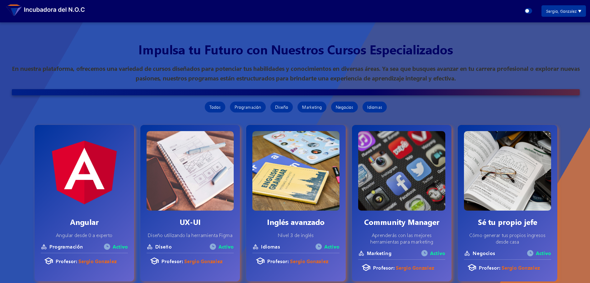

## Autores
- *Nahuel Argandoña* 🇦🇷 - 🐣 [Mi Github](https://github.com/Aubar48)
- *Gonzalo Miranda* 🇦🇷 - 🐣 [Mi Github](https://github.com/gonzalomiranda97)
- *Franco Gabrielleschi* 🇦🇷 - 🐣 [Mi Github](https://github.com/franmarg92)
- *Martín Nicolás Delhugo* 🇦🇷 - 🐣 [Mi Github](https://github.com/delhugo-martin)
<figure></figure>
<figure></figure>
<figure></figure>
# Proyecto: Portal Web Incubadora NOC y Web Centro Comercial Cruz del Eje

## Solicitante:
Incubadora del NOC

## Objetivo:
El proyecto tiene como finalidad la creación de una página web para la Incubadora del NOC, en colaboración con Santex y XAcademy. La institución requiere un portal donde se puedan comunicar los diferentes cursos de capacitación disponibles, futuras convocatorias para los cohortes del Academy y la gestión de los datos de los alumnos inscritos. Este es el principal proyecto (prioridad 1).

Además, se propone un segundo proyecto opcional: la creación de un sitio web para el Centro Comercial, Industrial y Anexos de Cruz del Eje, una institución que colabora estrechamente con la incubadora.

## Proyectos

### 1. Portal Web Incubadora NOC (PRIORITARIO)

#### Funcionalidades requeridas:
- **Gestión de contenido web**: Publicaciones de cursos y capacitaciones, información sobre programas de créditos, entrenamientos laborales y empresas colaboradoras.
- **Gestión de información de cursos**: Administración de los cursos de capacitación.
- **Gestión de información de alumnos**: Formulario de inscripción y administración de datos.
- **Gestión de asistencia y condiciones de aprobación**: Registro de asistencia y criterios de finalización.
- **Gestión de pagos**: Administración de matrícula y cuotas de cursos arancelados.
- **Gestión de docentes**: Inscripción y administración de especialidades de los docentes.

5. **EndPoints Get, Post, Put, Deleted**:
- IMPORTANTE CREAR USUARIO. USAR TOKEN AL LOGEARSE PARA USAR LAS DEMAS FUNCIONALIDADES 

- *Swagger:* http://localhost:3000/api-docs/#/

- *Post:* http://localhost:3000/api/login
- *Post:* http://localhost:3000/api/user/create

- *Post*: http://localhost:3000/api/login

- *Post*: http://localhost:3000/api/user/create

- *Get*: http://localhost:3000/api/user

- *Get*: http://localhost:3000/api/role

- *Get*: http://localhost:3000/api/userRole

- *Get*: http://localhost:3000/api/course

- *Get*: http://localhost:3000/api/registration

- *Get*: http://localhost:3000/api/note

- *Get*: http://localhost:3000/api/payment

- *Get*: http://localhost:3000/api/assistance

- *Get*: http://localhost:3000/api/publication

- *Get*: http://localhost:3000/api/content

- *Put*: http://localhost:3000/api/user

- *Put*: http://localhost:3000/api/role

- *Put*: http://localhost:3000/api/userRole

- *Put*: http://localhost:3000/api/course

- *Put*: http://localhost:3000/api/registration

- *Put*: http://localhost:3000/api/note

- *Put*: http://localhost:3000/api/payment

- *Put*: http://localhost:3000/api/assistance

- *Put*: http://localhost:3000/api/publication

- *Put*: http://localhost:3000/api/content

- *Delete*: http://localhost:3000/api/user

- *Delete*: http://localhost:3000/api/role

- *Delete*: http://localhost:3000/api/userRole

- *Delete*: http://localhost:3000/api/course

- *Delete*: http://localhost:3000/api/registration

- *Delete*: http://localhost:3000/api/note

- *Delete*: http://localhost:3000/api/payment

- *Delete*: http://localhost:3000/api/assistance

- *Delete*: http://localhost:3000/api/publication

- *Delete*: http://localhost:3000/api/content
